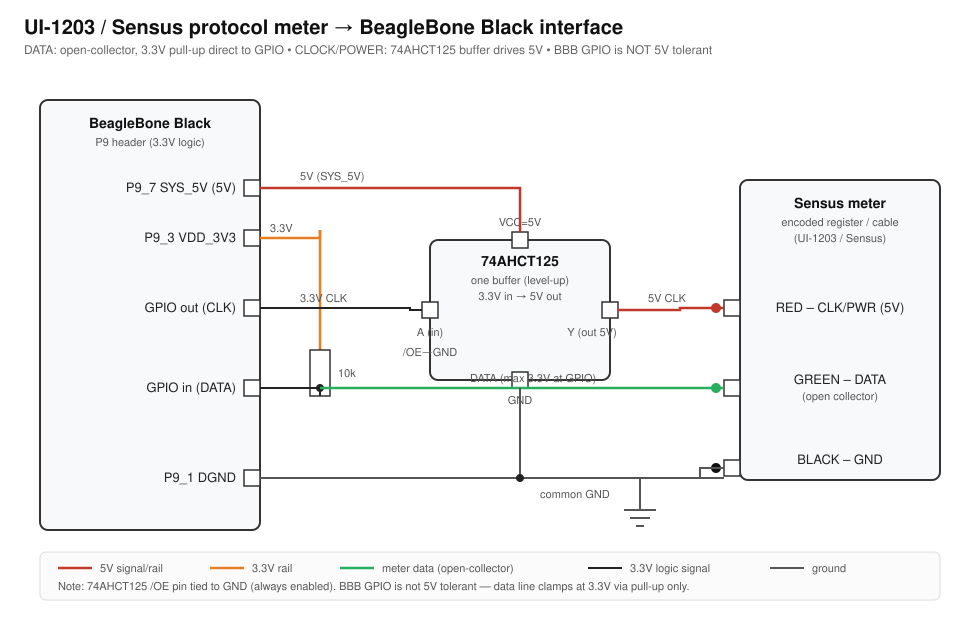

# UI-1203 (Sensus) meter reader

This library reads encoded water meters that speak the **UI-1203 / Sensus
protocol** (ASCII). The protocol is a plain-GPIO *power-toggle bit-banger*: the
host toggles power/clock to the meter and reads bits back, decoding 10-bit
aligned frames with a sliding-window sync.

Key types in [`ui1203.h`](ui1203.h):

- `UI1203_Reader` — power-toggle bit-banger that drives the clock/power line and
  samples the data line.
- `UI1203_Decoder` — pure framing decoder with sliding-window sync (frames that
  fail parity are rejected).

## Tested hardware

- **Meter:** ZENNER Stealth Ultrasonic (ZSU / ZSUR) with the ZENNER Stealth
  Ultrasonic Interface Cable. ZENNER's NDC module is "configured for Sensus
  Protocol (ASCII) and conform[s] to UI-1203", so this reader applies directly.
- **Host:** BeagleBone Black.

## Electrical interface

This interface applies to **any UI-1203 / Sensus protocol meter**. The meter
expects **5 V logic**, but the BeagleBone Black GPIO is **3.3 V and is
not 5 V tolerant**. The two signal lines have opposite needs:

| Line              | Direction        | Nature                         | Interface                                          |
|-------------------|------------------|--------------------------------|----------------------------------------------------|
| RED — CLK/PWR     | BBB &rarr; meter | host toggles to power & clock  | **74AHCT125** buffer @ 5 V drives a true 5 V high  |
| GREEN — DATA      | meter &rarr; BBB | **open collector** (pulls low) | **10 kΩ pull-up to 3.3 V**, direct to GPIO         |
| BLACK — GND       | —                | common ground                  | shared between BBB, buffer, and meter              |

Because the data line is open-collector, pulling it up to 3.3 V keeps the BBB
GPIO at a safe 3.3 V high — no level shifter is needed on that line. The
clock/power line *powers* the meter module, so it is driven by a 74AHCT125 quad
buffer (which accepts the BBB's 3.3 V GPIO as a valid input and outputs a strong
push-pull 5 V). A passive BSS138 level shifter is **not** recommended here: its
weak pull-ups cannot reliably source the meter's supply current.

### Bill of materials

- Adafruit **74AHCT125** quad-buffer breakout (#1787) — clock/power driver,
  `VCC` from `SYS_5V` (P9_7/P9_8), `/OE` tied to GND.
- One **10 kΩ** resistor — data-line pull-up to 3.3 V (P9_3/P9_4).
- A Sensus-protocol meter cable (3-wire: clock/power, data, ground). The first
  hardware test uses the ZENNER Stealth bare-3-wire interface cable.

### Schematic

## Future work

See [`hardware.md`](hardware.md) for work-in-progress, hypothetical research
outlining a possible open-source hardware cape (prototype &rarr; verify &rarr;
small production run) for water systems.
